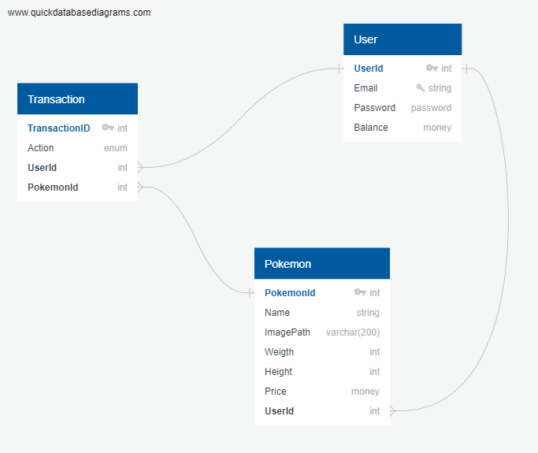

# PokéCoin
The goal of this test is to create an exchange platform to trade pokémon as NFTs.

## Requirement
- Ruby
- Rails framework
- Use of sqlite
- Use of Active Record
- Use of Active Controller

## Project Specifications
You can use any gem in order to make this project.

#### HTTP Routes:
| **VERB** | **Route**             | **Description**                         |
|----------|-----------------------|-----------------------------------------|
| [GET]    | /                     | Landing Page                            |
| [GET]    | /pokemon              | List All Pokemon                        |
| [GET]    | /pokemon/:id          | Shows a Pokemon                         |
| [GET]    | /pokemon/:id/checkout | Proceed to buy a Pokemon                |
| [POST]   | /pokemon/:id/buy      | Validates and transact a valid purchase |
| [POST]   | /pokemon/:id/sell     | Validates and transact a valid sale     |
| [GET]    | /me                   | Displays the logged in user account     |
| [GET]    | /me/add               | Shows a screen to add money to wallet   |
| [PATCH]  | /me/add               | Adds money to the wallet                |
| [GET]    | /me/transactions      | Shows all user transactions             |

feel free to add extra routes

#### Registering a Buy (from the exchange):
- Check if user has enough USD_BTC to buy
- Decrement from user balance
- Change the pokemon owner
- Change the last_sell_price
- Register a transaction with a BUY operation

#### Registering a Sell (to the exchange):
- Check if user really own that Pokemon
- Change the pokemon owner
- Change the last_sell_price
- Add to from user balance
- Register a transaction with a SELL operation

## ERD Diagram

## Bonus
Feel free to make as many improvements as you like.
We love creativity and technical challenges.
Here's some examples:
- Write a documentation of the project
- Unit test
- Etc...

## Submission
You can either create a git repo with free access or send the repo back via mail
